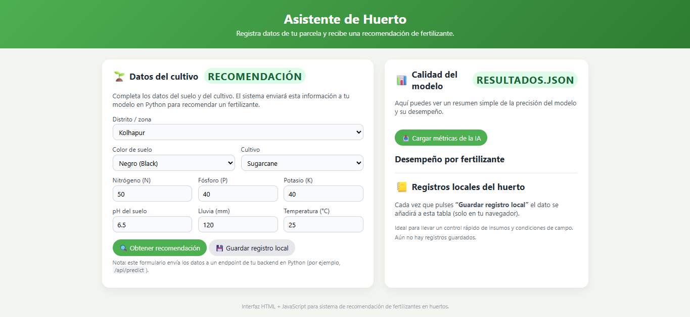
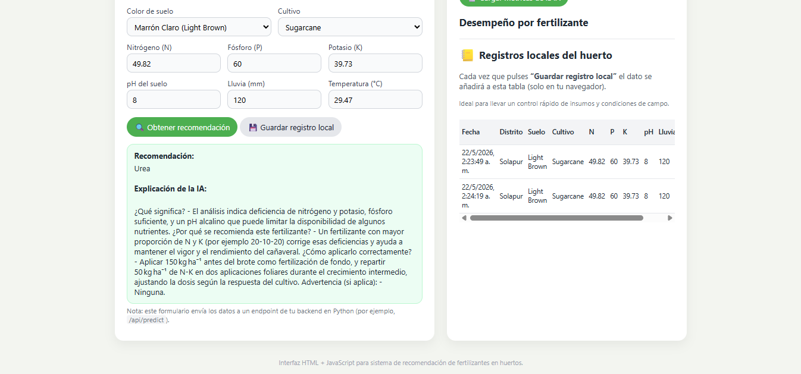
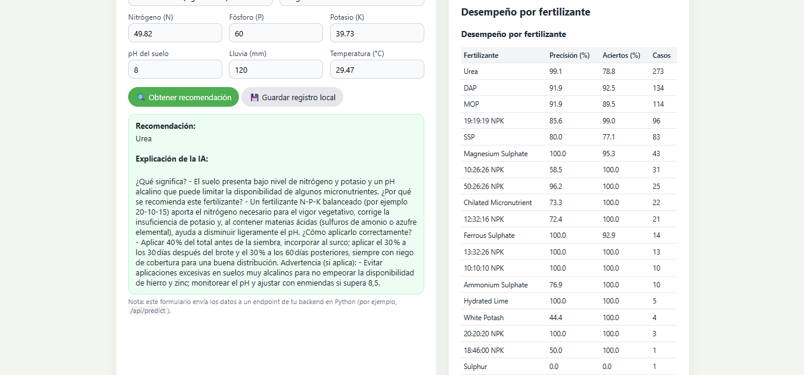

# 🌱 Sistema Inteligente de Recomendación de Fertilizantes con Machine Learning + IA Generativa

AI Fertilizer Recommendation System

La aplicación permite registrar información agrícola de una parcela y obtener una recomendación automática de fertilizante junto con una explicación generada mediante un LLM.

[--> Link del Sistema Inteligente <--](https://ia-sistema-fertilizantes.onrender.com)



---

## 🚀 Características

- Predicción de fertilizantes usando Machine Learning
- Modelo Random Forest optimizado
- Interfaz web interactiva
- Explicaciones generadas con IA
- Persistencia del modelo entrenado
- Procesamiento de variables categóricas
- API backend con Flask

---

## 🧠 Tecnologías utilizadas

### Backend & ML
- Python
- Flask
- Scikit-learn
- Pandas
- NumPy
- Joblib

### IA Generativa
- Ollama API
- LLM Integration

### Deployment
- Gunicorn
- Procfile

---

## 📊 Dataset

El modelo utiliza un dataset agrícola con información relacionada a:

- Distrito
- Tipo de suelo
- Cultivo
- Nitrógeno (N)
- Fósforo (P)
- Potasio (K)
- pH
- Lluvia
- Temperatura

El objetivo es predecir el fertilizante más adecuado según las condiciones de la parcela.

---

## ⚙️ Modelo de Machine Learning

El sistema utiliza un modelo:

- Random Forest Classifier

### Configuración principal

```python
RandomForestClassifier(
    n_estimators=300,
    max_depth=15,
    min_samples_split=4,
    class_weight='balanced'
)
```

### Proceso implementado

- Preprocesamiento de datos
- Encoding de variables categóricas
- División train/test
- Entrenamiento supervisado
- Evaluación del modelo
- Exportación del modelo y encoders

---

## 🤖 Explicación con IA Generativa

Después de realizar la predicción, el sistema envía el resultado a un LLM para generar explicaciones agrícolas en lenguaje natural.

La IA proporciona:

- Significado de la recomendación
- Razón de uso del fertilizante
- Forma correcta de aplicación
- Advertencias importantes

---

## 🖥️ Interfaz del sistema

### 📌 Formulario principal


### 📌 Resultado y Explicación por IA


### 📌 Métricas del modelo


---

## 📂 Estructura del proyecto

```text
├── app.py
├── EntrenamientoIA.py
├── Chatbox.py
├── fertilizer_prediction_model.pkl
├── label_encoders.pkl
├── Crop_and_fertilizer_dataset.csv
├── resultados.json
├── requirements.txt
├── procfile
└── index.html
```

---

## 📈 Futuras mejoras

- Dashboard analítico
- Soporte para más cultivos
- Predicción avanzada con Deep Learning
- Recomendaciones personalizadas
- Deploy cloud escalable
